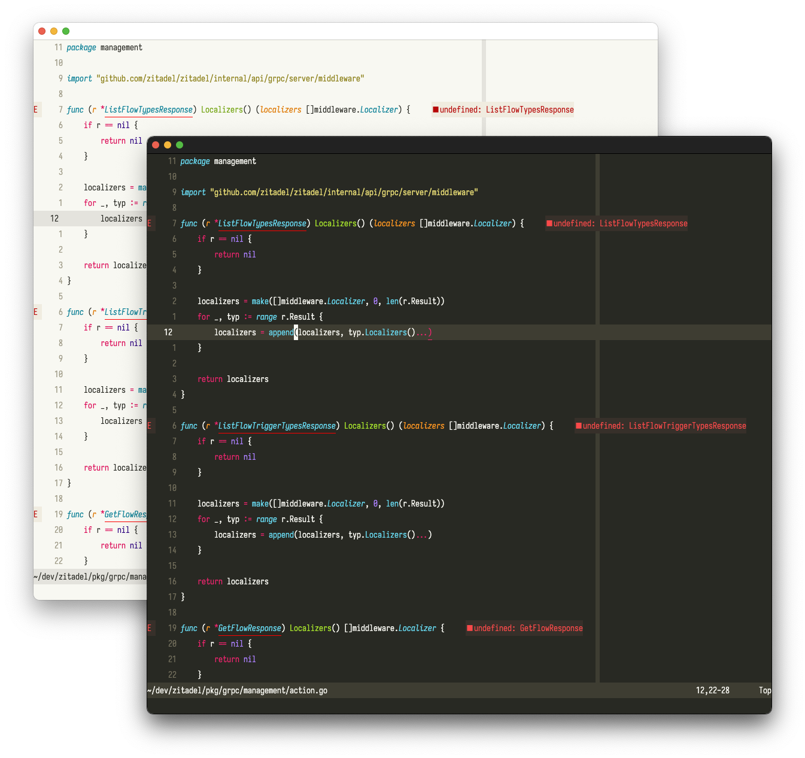

# Molokai

Dark and light [Neovim](https://github.com/neovim/neovim) colorscheme made with [lush](https://github.com/rktjmp/lush.nvim).
Colors are mostly taken from [tomasr](https://github.com/tomasr/molokai).



## Install

Using [lazy](https://github.com/folke/lazy.nvim) for example:

```lua
{
    "fabius/molokai.nvim",
    lazy = false,
    priority = 1000,
},
```

## Usage

```lua
vim.cmd "colorscheme molokai-light"
vim.cmd "colorscheme molokai"
```

### Lualine

```lua
require('lualine').setup {
    options = {
        theme = 'molokai'
    }
}
```
